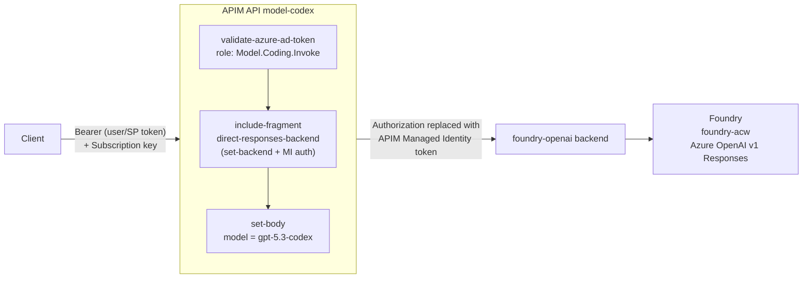

# Portal step-through — the gpt-5.3-codex API (Coding)

A focused, click-by-click tour of the **`model-codex`** API in the **Azure
portal**: where each piece lives, how the request flows, and — the part that is
easy to miss — **where the backend authentication to Foundry (managed identity)
actually is**.

This page is scoped to the single codex API. For the full multi-model setup
(Entra roles, all three APIs, products, subscriptions) see
[portal-setup.md](portal-setup.md). The Bicep in
[../infra/main.bicep](../infra/main.bicep) remains the source of truth.

> **What this API is:** `POST https://<apim>.azure-api.net/codex/responses`,
> locked server-side to **gpt-5.3-codex**, gated by the **`Model.Coding.Invoke`**
> Entra app role, and calling Foundry over the APIM **system-assigned managed
> identity**. gpt-5.3-codex is a **Responses-API** model — send `{"input": "..."}`,
> not `chat/completions`.

---

## Reference values (this lab)

| Thing | Value |
| --- | --- |
| API Management instance | `aig-acw` |
| API (display name) | `Model — gpt-5.3-codex (Coding)` |
| API (name / suffix) | `model-codex` / `codex` |
| Operation | `POST /responses` |
| Backend | `foundry-openai` → `https://foundry-acw.openai.azure.com/openai/v1` |
| Policy fragment (MI auth) | `direct-responses-backend` |
| Foundry account | `foundry-acw` |
| Required app role | `Model.Coding.Invoke` |
| Product / subscription | `Coding Assistants` / `coding-assistants-demo` |

---

## The request flow (what you're tracing in the portal)



Two independent auth legs:

1. **Client → APIM** — the caller's Entra token is checked for the
   `Model.Coding.Invoke` role. This token **stops at the gateway**.
2. **APIM → Foundry** — APIM swaps in its **own managed identity** token
   (scoped to `https://cognitiveservices.azure.com`). Foundry trusts it because
   the APIM identity holds **Cognitive Services User** on `foundry-acw`.

---

## Step 1 — Open the API

1. **API Management** → **`aig-acw`** → left menu **APIs** → **APIs**.
2. Select **Model — gpt-5.3-codex (Coding)**.
3. You land on the **Design** tab with the `POST Responses` operation listed.

---

## Step 2 — See the policy (pick the right scope!)

This is the step most people get wrong. In the operations list there are **two
policy scopes**:

- **`POST Responses`** (the individual operation) — this shows only the empty
  `<base />` template. **This is not where the policy is.**
- **All operations** — this is the **API scope**, where `codex.xml` is applied.

**Click `All operations`**, then **Inbound processing** → the **`</>`** (code
editor) icon. The breadcrumb should now read
`Model — gpt-5.3-codex (Coding) > All operations > Policies`.

You should see, in order:

```xml
<validate-azure-ad-token tenant-id="{{aad-tenant-id}}" ...>
    <audiences><audience>{{model-audience}}</audience></audiences>
    <required-claims>
        <claim name="roles" match="any">
            <value>Model.Coding.Invoke</value>
        </claim>
    </required-claims>
</validate-azure-ad-token>
<include-fragment fragment-id="direct-responses-backend" />
<set-body>@{ ... body["model"] = "gpt-5.3-codex"; ... }</set-body>
```

- **`validate-azure-ad-token`** — authorization (role check). Returns **403** if
  the caller lacks `Model.Coding.Invoke`.
- **`include-fragment`** — a pointer to the backend routing + MI auth (see next
  step). The MI line is **not** inline here.
- **`set-body`** — pins the model to `gpt-5.3-codex`, so a coding key can't be
  repurposed to call another model.

---

## Step 3 — See the managed-identity backend auth

The `authentication-managed-identity` line lives in the **fragment**, not the API
policy.

1. Left menu **APIs** → **Policy fragments**.
2. Open **`direct-responses-backend`**.

You'll see the actual backend authentication:

```xml
<set-backend-service backend-id="foundry-openai" />
<authentication-managed-identity resource="https://cognitiveservices.azure.com" />
```

`authentication-managed-identity` fetches an Entra token for APIM's
system-assigned identity and **replaces the `Authorization` header** with that MI
token before the request leaves the gateway. (Note: the codex fragment sends no
`api-version` query parameter — the Azure OpenAI **v1** path doesn't need one,
unlike the chat/completions models which use `direct-models-backend`.)

---

## Step 4 — See where it points (backend)

1. Left menu **APIs** → **Backends** → **`foundry-openai`**.
2. Confirm the runtime URL:
   `https://foundry-acw.openai.azure.com/openai/v1` (Azure OpenAI v1 Responses
   endpoint).

> gpt-5.3-codex uses this **`foundry-openai`** backend, *not* the
> `foundry-models` backend the chat/completions models use.

---

## Step 5 — See the identity itself

1. API Management → **`aig-acw`** → **Settings** → **Managed identities**
   (or **Security** → **Managed identities**).
2. Confirm **System assigned** = **On**; note the **Object (principal) ID**.

---

## Step 6 — See why Foundry trusts APIM (role assignment)

1. Open the Foundry account **`foundry-acw`** → **Access control (IAM)** →
   **Role assignments**.
2. Look for APIM's identity (the principal ID from Step 5) holding
   **Cognitive Services User**.

Without this role, calls reach Foundry but fail with **500** (or an auth error)
because the MI token isn't authorized.

---

## Step 7 — See the product & subscription

1. **Products** → **Coding Assistants** → confirm the API **`model-codex`** is
   attached and the product is **Published** with **Requires subscription** on.
2. **Subscriptions** → **`coding-assistants-demo`** (scope = product
   *Coding Assistants*) → **Show/hide keys** to grab the subscription key used in
   the test below.

---

## Step 8 — Test from the portal

Use the **Test** tab on the codex API:

1. API **Model — gpt-5.3-codex (Coding)** → **Test** → **Responses** operation.
2. The portal auto-adds a subscription key. Add an **Authorization** header with a
   bearer token for an identity holding `Model.Coding.Invoke` (see
   [portal-setup.md](portal-setup.md) Part A / Part C for getting a token).
3. **Body:** `{"input": "say hi"}`.
4. **Send.**

| Situation | Expected |
| --- | --- |
| Valid coding-role token + subscription key | **200** with a gpt-5.3-codex reply |
| Missing/invalid subscription key | **401** (before your policy runs) |
| Token without `Model.Coding.Invoke` | **403** from `validate-azure-ad-token` |
| Called `/codex/chat/completions` | **400** — codex is Responses-only |
| MI missing **Cognitive Services User** on `foundry-acw` | **500** from backend |

---

## Quick "where is it" cheat sheet

| You want to see… | Portal location |
| --- | --- |
| Role check + model pinning | API `model-codex` → **All operations** → Inbound `</>` |
| **Managed-identity backend auth** | **Policy fragments** → `direct-responses-backend` |
| Foundry endpoint URL | **Backends** → `foundry-openai` |
| The APIM identity | `aig-acw` → **Managed identities** |
| Why Foundry trusts APIM | `foundry-acw` → **Access control (IAM)** |
| Access bundle + keys | **Products** → `Coding Assistants`, **Subscriptions** → `coding-assistants-demo` |
